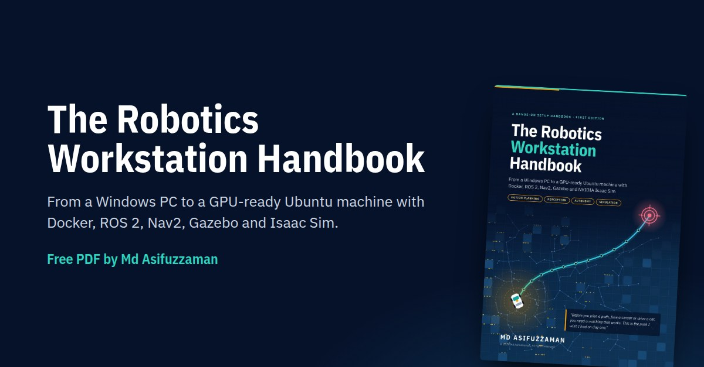

# Md Asifuzzaman · Role-based portfolio

One page per engineering role, each backed by finished projects, measured results and a live in-browser demo.

| Role | Live page | Live demo |
|---|---|---|
| Motion Planning Engineer | https://asif-ucchwas.github.io/ | Four planners, including my A*-guided corridor RRT*, racing on the same map |
| Controls Engineer | https://asif-ucchwas.github.io/controls/ | My DC servo with feedback-only and feedforward control, with a disturbance toggle |
| Embedded Systems Engineer – Vehicle Networks | https://asif-ucchwas.github.io/embedded/ | Bit-by-bit CAN arbitration and a J1939 frame encoder |

Each page also lists the project I'm building now and the gaps I'm closing next.

## Free handbook

**The Robotics Workstation Handbook**: a free, step-by-step guide from a Windows PC to a GPU-ready Ubuntu workstation with Docker, ROS 2, Nav2, Gazebo and Isaac Sim.

Book page and free PDF: https://asif-ucchwas.github.io/handbook/
